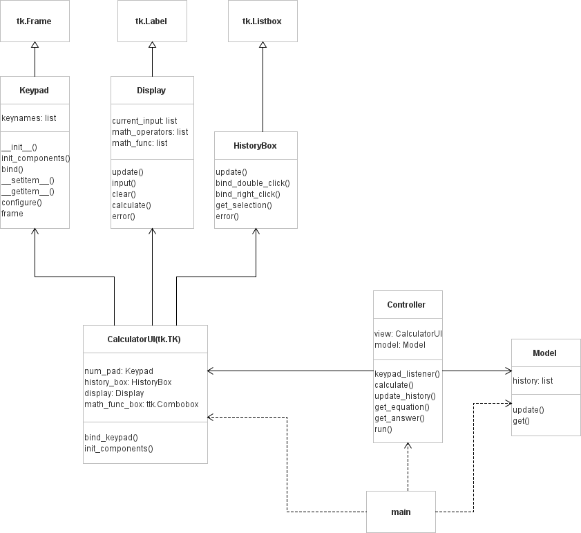

# calculator
A calculator written in Python. Part of Computer Programming II assignment.

## How to run?
run the main.py file.

## Dependencies
The calculator uses `pygame` library to play the sound. You can install it by typing the following command:
```py
pip install pygame
```

## UML Diagram
